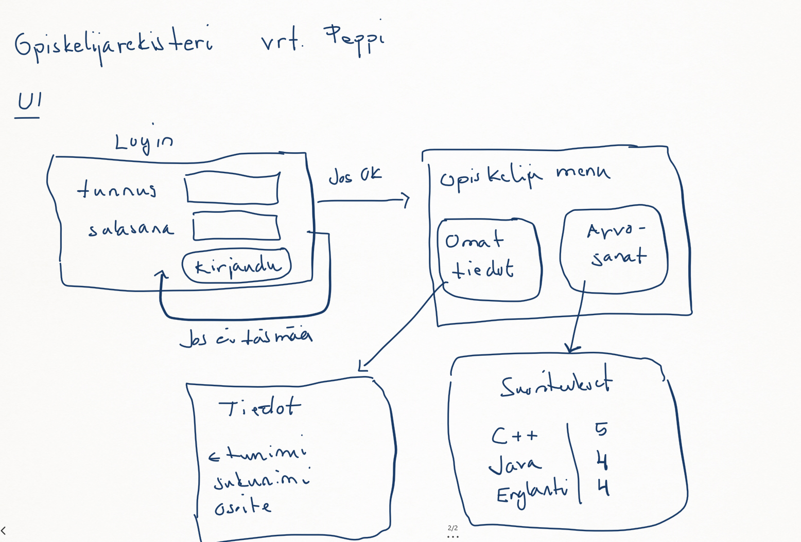
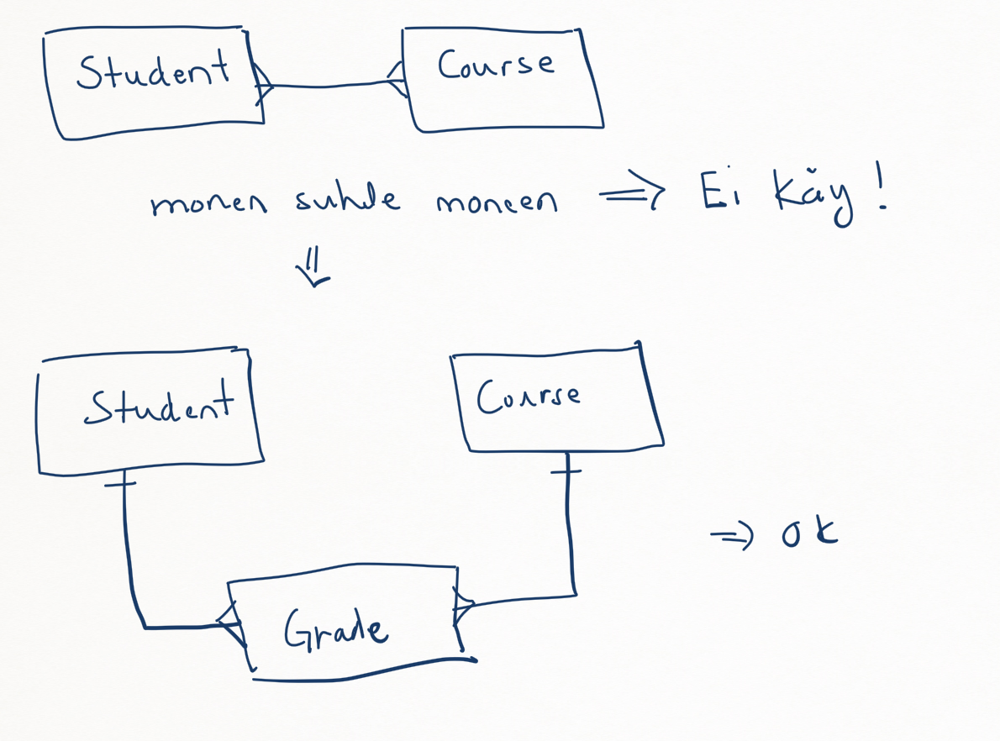
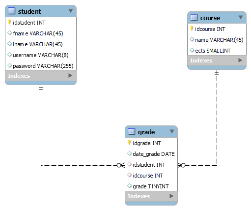

# group_x

Projektin aihe on yksinkertainen opiskelijarekisteri (vrt. Peppi)

## Ui suunnitelma

Sovelluksen käyttöliittymä on seuraavanlainen

## ER-kaavio

Hahmotelma  

 
Lopullinen 

### Oikeudet tietokantaan

<pre>
create user netuser@127.0.0.1 identified by 'netpass';
grant all on peppidb.* to netuser@127.0.0.1;
</pre>

## .env

Huom! Tiedosto .env pitäisi oikeasti jättää pois GitReposta (ainakin julkisesta ja varsinkin jos siinä on salasanoja)
